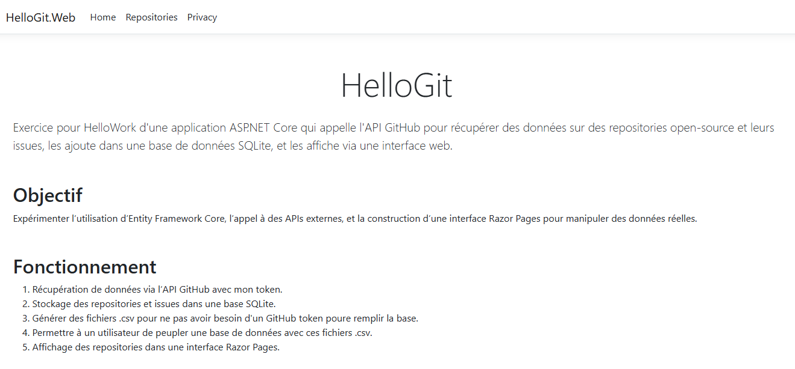
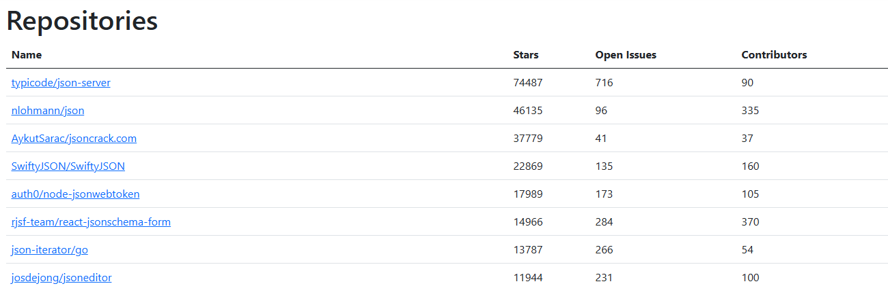

# HelloWGit

<p align="center">
  
</p>

Exercice de développement ASP.NET Core consistant à interagir avec l'API GitHub pour récupérer des données sur des repositories open-source et leurs issues, les stocker dans une base de données SQLite, et les afficher via une interface web.

## Objectifs

- Expérimenter l’utilisation d’Entity Framework Core.
- Appeler une API externe (GitHub).
- Construire une interface web avec Razor Pages.
- Manipuler des données réelles issues de GitHub.

## Fonctionnement

- Récupération de données depuis l’API GitHub à l’aide d’un token personnel.
- Stockage des repositories et de leurs issues dans une base de données SQLite.
- Génération de fichiers `.csv` pour peupler la base sans appel réseau ni token GitHub.
- Possibilité pour un utilisateur de remplir la base de données à partir de ces fichiers `.csv`.
- Affichage des repositories via une interface Razor Pages.

<p align="center">
  
</p>

## Structure du projet

La solution est composée de deux projets :

- `HelloGit.Api` : Application console permettant de remplir la base de données à partir des fichiers `.csv`.
- `HelloGit.Web` : Application web en Razor Pages affichant les données depuis la base.

## Étapes pour exécuter le projet

1. **Cloner la solution**
   ```bash
   git clone https://github.com/Mushkhushu/HelloGit
   cd HelloGit
2. **Restaurer les packages**
   ```bash
   dotnet restore
3. **Peupler la base avec les fichiers .csv**
   ```bash
   dotnet run --project HelloGit.Api
Cette commande lit les fichiers .csv (contenant les données GitHub) et insère les données dans la base SQLite.

4. **Lancer l'application web**
   ```bash
   dotnet run --project HelloGit.Web
5. **Afficher les données**

    L’application sera accessible à l’adresse indiquée dans la console (par défaut : http://localhost:5238).
    Une fois l’application lancée, aller dans l’onglet "Repositories" pour consulter les données importées.